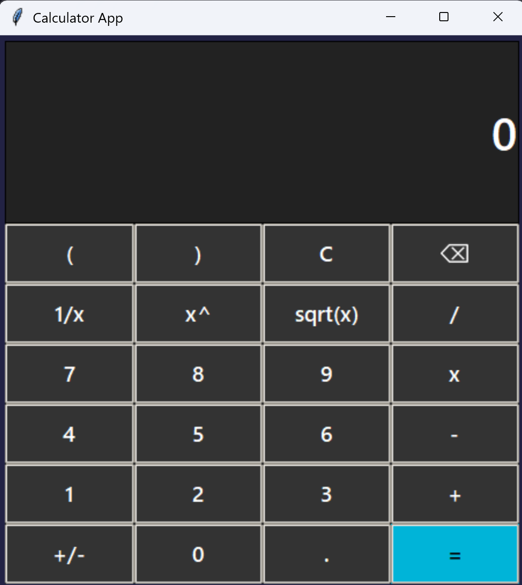

<a id="readme-top"></a>


[![MIT License][license-shield]][license-url]


<!-- PROJECT LOGO -->
<br />
<div align="center">
  <a href="https://github.com/TalhaAgro/Calculator-GUI">
    
  </a>

<h3 align="center">Calculator App</h3>

  <p align="center">
    A cool Calculator starter project I am making to hone my programming skills.
    <br />
    <a href="https://github.com/TalhaAgro/Calculator-GUI"></a>
    <br />
    <br />
  </p>
</div>
<!-- TABLE OF CONTENTS -->
<details>
  <summary>Table of Contents</summary>
  <ol>
    <li>
      <a href="#about-the-project">About The Project</a>
      <ul>
        <li><a href="#built-with">Built With</a></li>
      </ul>
    </li>
    <li>
      <a href="#getting-started">Getting Started</a>
      <ul>
        <li><a href="#prerequisites">Prerequisites</a></li>
        <li><a href="#installation">Installation</a></li>
      </ul>
    </li>
    <li><a href="#usage">Usage</a></li>
    <li><a href="#license">License</a></li>
    <li><a href="#contact">Contact</a></li>
    <li><a href="#acknowledgments">Acknowledgments</a></li>
  </ol>
</details>


## About the Project



This project is meant to improve my programming skills, especially as a simple project. I coded this with no outside help - no ChatGPT, no YouTube videos, no Stack Overflow code pasted here.

The only resources I used were the documentation of the tkinter, ttk and pillow libraries.


<p align="right">(<a href="#readme-top">back to top</a>)</p>


### Built With

* [![Python][Python.com]][Python-url]

<p align="right">(<a href="#readme-top">back to top</a>)</p>


## Getting Started

To get a local copy up and running follow these simple steps.

### Prerequisites

You should be familiar with:
* Python

  > Navigate to the [Python Website](https://www.python.org/) to download if required.

### Installation

1. Clone the repo
   * Git Bash:

   ```sh
   git clone https://github.com/TalhaAgro/Calculator-GUI.git
   cd "Calculator-GUI"
   ```

2. Download UV Package Manager
   
   For more information, use the [UV Website](https://docs.astral.sh/uv/getting-started/installation/)
   * Mac/Linux:

   ```sh
   curl -LsSf https://astral.sh/uv/install.sh | sh
   ```
   * Windows:

   ```powershell
   powershell -ExecutionPolicy ByPass -c "irm https://astral.sh/uv/install.ps1 | iex"
   ```

3. Sync with UV
   ```sh
   uv sync
   ```

<p align="right">(<a href="#readme-top">back to top</a>)</p>


## License

Distributed under the MIT License. See `LICENSE.txt` for more information.

<p align="right">(<a href="#readme-top">back to top</a>)</p>


## Contact

Talha Agro - talha.agro50@gmail.com

Project Link: [https://github.com/TalhaAgro/Calculator-GUI](https://github.com/TalhaAgro/Calculator-GUI)

<p align="right">(<a href="#readme-top">back to top</a>)</p>


<!-- ACKNOWLEDGMENTS -->
## Acknowledgments

* Raahim Imran

<p align="right">(<a href="#readme-top">back to top</a>)</p>


<!-- MARKDOWN LINKS & IMAGES -->
<!-- https://www.markdownguide.org/basic-syntax/#reference-style-links -->
[license-shield]: https://img.shields.io/github/license/TalhaAgro/Calculator-GUI.svg?style=for-the-badge
[license-url]: https://github.com/TalhaAgro/Calculator-GUI/blob/master/LICENSE.txt
[product-screenshot]: images/screenshot.png
[Python-url]: https://www.python.org/
[Python.com]: https://img.shields.io/badge/python-3670A0?style=for-the-badge&logo=python&logoColor=ffdd54